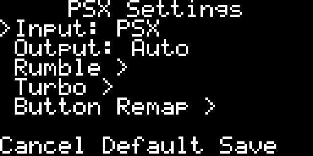
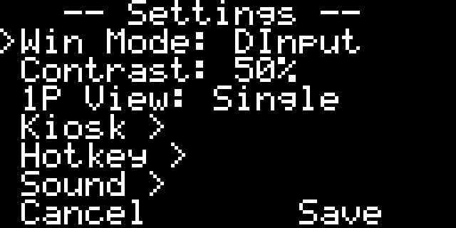
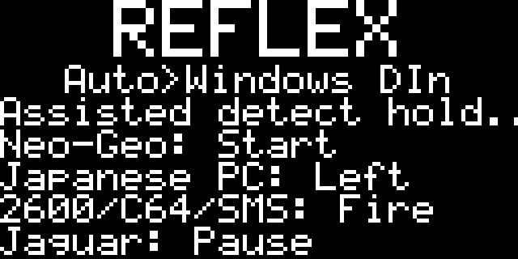

# Reflex Adapt Classic2USB

Classic2USB is the unified RP2040 firmware for Reflex Adapt classic-controller
USB adapters. Every supported input and output mode fits in one firmware image,
so changing controllers or hosts no longer requires reflashing the adapter.

For setup, see the [Classic2USB Quick Start](docs/classic2usb/Classic2USB-Quick-Start.md).
For complete behavior and compatibility details, see the
[Classic2USB Manual](docs/classic2usb/Classic2USB.md) and
[Input Reference](docs/classic2usb/Classic2USB-Input-Reference.md).

Reflex Adapt hardware is available from the
[Reflex Adapt product page](https://misteraddons.com/collections/kits/products/reflex-adapt).
Compatible controller cables and breakouts are listed with the
[HDMI controller adapters](https://misteraddons.com/products/hdmi-controller-adapters).

## Highlights

1. **One universal firmware** - all Classic2USB input modes, USB output modes,
   settings, and utilities are available in one UF2 image.
2. **Ultra low latency** - many digital-controller modes measure below 1 ms mean
   latency with 1 ms USB polling.
3. **Automatic controller detection** - Auto input recognizes most supported
   controller families, while the rest use clear on-screen assisted
   detection prompts.
4. **Automatic host detection** - Auto output identifies supported Windows,
   Linux/MiSTer, Xbox, PlayStation 3/4, and Nintendo Switch hosts and selects
   the matching USB mode.
5. **On-device configuration** - the OLED menu exposes controller, output,
   display, hotkey, rumble, analog, and system settings without requiring a PC.
6. **Per-button customization** - configure turbo and remapping per button,
   with configurable Home, Capture, Quick Menu, and System Menu hotkeys.
7. **Two-player features** - native two-port operation where supported,
   two-player DInput and XInput PC output, plus 2P Merge for combining both
   physical inputs into one virtual controller for wacky fun.
8. **Memory-card and accessory tools** - access Dreamcast VMUs, PlayStation
   Memory Cards, N64 Controller Paks, and N64 Transfer Pak GB/GBC ROM and save
   data through the serial management interface, including full-card and
   individual-save backup and restore.
9. **MiSTer integration** -
   [`reflex_adapt_manager.sh`](tools/release_assets/adapt-manager/mister/Scripts/reflex_adapt_manager.sh)
   installs firmware, rollbacks, and required mappings for Classic2USB and
   Adapt V1 / Legacy from one menu.

## Device Buttons and Menus

| Physical control | Action | Result |
|------------------|--------|--------|
| Left device button (Reset) | Tap | Reset and reboot Classic2USB |
| Left device button (Reset) | Hold (3 s) | Start Auto input detection |
| Left device button (Reset) | Hold while connecting to USB | Enter the RP2040 UF2 bootloader |
| Right device button (Mode) | Tap | Open Quick Settings for the current input mode |
| Right device button (Mode) | Hold (3 s) | Open System Settings |

Quick Settings contains the controls relevant to the active controller family.
For example, PSX mode exposes input/output selection, rumble, turbo, and button
remapping:



System Settings contains global Windows output, display contrast, home-screen,
Kiosk Mode, hotkey, sound, and other device settings:



<video controls width="642" poster="docs/media/classic2usb/system-settings-menu.png" src="docs/media/classic2usb/system-settings-menu.mp4">
  <a href="docs/media/classic2usb/system-settings-menu.mp4">Watch the System Settings menu recording.</a>
</video>

[Open the System Settings menu recording](docs/media/classic2usb/system-settings-menu.mp4).

**Reflex Kiosk Mode** is available under **Kiosk** in System Settings and is off
by default. Selecting it opens an **On / Off / Cancel** confirmation. Enabling
it prevents accidental front-button actions: opening Quick Settings or rebooting
requires two quick taps instead of one. The 3-second holds still open System
Settings and start Auto input detection, and holding Reset while connecting USB
still enters the bootloader.

## Input Support and Latency

Measured results are end-to-end using MiSTer in DInput mode, the NES
latency-test core, an external Arduino fixture, and 1 ms USB polling. Complete
sample counts, minimums, maximums, and methodology are documented in the
[Classic2USB Manual](docs/classic2usb/Classic2USB.md#measured-input-latency).



| Input Mode | Supported Controllers and Accessories | Players | Detection | Mean Latency |
|------------|---------------------------------------|:-------:|:---------:|-------------:|
| Atari / C64 / SMS | Atari 2600, C64, and SMS joysticks; Atari Driving Controller | 2 | Assisted | 0.815 ms |
| Japanese PC | MSX, FM Towns, and X68000 controller family | 2 | Assisted | 0.815 ms |
| Genesis / Mega Drive | 3-button and 6-button pads; 8BitDo M30 2.4G in 6-button mode | 2 | Auto | 0.899 ms |
| Saturn | Digital pad, 3D Pad, racing wheel, and Mission Stick | 2 | Auto | 0.886 ms |
| Dreamcast | Pad, racing wheel, Mission Stick, and VMU | 2 | Auto | 2.978 ms |
| PlayStation | Digital and analog pads, DualShock, DualShock 2, neGcon, JogCon, dance pad, guitar, Pop'n controller, and GunCon | 2 | Auto | 1.625 ms |
| NES | Pad and Power Pad | 2 | Auto | 0.883 ms |
| SNES | Pad, NTT Data keypad, and RumbleTech | 2 | Auto | 0.890 ms |
| N64 | Controller, Rumble Pak, Controller Pak (memory card), and Transfer Pak[^transfer-pak] | 2 | Auto | 1.427 ms |
| GameCube | Controller, WaveBird, and DK Bongos (Untested) | 2 | Auto | 1.604 ms |
| Wii | Classic Controller, Classic Pro, and Nunchuk | 2 | Auto | 1.176 ms |
| Virtual Boy | Controller | 2 | Auto | 0.917 ms |
| PC Engine / TurboGrafx-16 | Standard and 6-button pads | 2 | Auto | 0.916 ms |
| Neo Geo | One-player and two-player controller ports | 2 | Assisted | 0.766 ms |
| 3DO | Controller; Flight Stick (Untested) | 2 | Auto | Not measured |
| Jaguar | Controller, Pro Controller, and rotary | 2 | Assisted | 0.949 ms |

[^transfer-pak]: Transfer Pak save management is available only through
    [`Adapt.html`](web/Adapt.html) for compatible Game Boy and Game Boy Color
    cartridges.

## Output Support

| Output Mode | Intended Hosts | Players | Notes |
|-------------|-----------------|:-------:|-------|
| DInput | Windows, Linux, MiSTer | 2 | Recommended for MiSTer and configuration |
| XInput PC | Windows/Linux XInput | 2 | Two independent wired XInput controllers |
| Xbox Classic | Original Xbox | 1 | Native XID output |
| Xbox 360 | Xbox 360, PC | 1 | Authenticated console output |
| PS3 | PlayStation 3 | 1 | DualShock 3 style output |
| PS4 | PlayStation 4 | 1 | Requires user-provided PS4 authentication keys |
| PS4-compatible PS5 | PlayStation 5 | 1 | For PS5 games that accept PS4 controllers; requires PS4 auth keys |
| Switch Pro | Switch and Switch 2 | 2 | Switch Pro style output |
| Keyboard | Keyboard-compatible hosts | 1 | Configurable keyboard mapping |

MiSTer also has specialized GunCon, JogCon, and neGcon paths. Most standard
controller modes work through MiSTer's GameControllerDB; N64, PlayStation,
Saturn, and Jaguar layouts use dedicated `.map` files where the generic mapping
format cannot express the complete controller.

## Build

Classic2USB is the release PlatformIO environment:

```powershell
pio run -e classic2usb -t uf2
```

The UF2 is exported to `dist/classic2usb.uf2`.

Build the complete release package with firmware, documentation, MiSTer files,
and artifact hashes:

```powershell
python tools/package_release.py --target classic2usb
```

The package is written to `dist/classic2usb_package`.

## Repository Layout

| Path | Purpose |
|------|---------|
| `firmware/` | Shared firmware source |
| `firmware/config/classic2usb/` | Classic2USB pins, identity, defaults, roles, and feature gates |
| `third_party/` | Vendored libraries, references, and license copies |
| `docs/architecture.md` | Shared firmware architecture and module boundaries |
| `docs/classic2usb/` | Classic2USB quick start, manual, input reference, and protocol references |
| `docs/media/classic2usb/` | Classic2USB documentation images and video |
| `web/` | Shared browser dashboard and styles |
| `tools/` | Build, release, validation, and maintainer tools |
| `tools/adapt_manager/` | Unified MiSTer firmware, settings, recovery, and mapping manager |
| `.github/workflows/` | Build and release automation |

## Reflex Adapt Manager

MiSTer uses one Downloader database and one `reflex_adapt_manager.sh` entry
point for supported Adapt products. The manager detects connected hardware and
offers only applicable firmware, rollback, settings, and mapping actions.

Classic2USB's DInput utility drive includes `ADAPTDL.INI` as a small Downloader
bootstrap. You can also install `tools/adapt_manager/reflex-adapt-manager.ini`
with MiSTer Downloader or copy the packaged `mister/` directory to
`/media/fat/`.

Adapt V1 / Legacy firmware remains in the separate
[Reflex-Adapt-Legacy](https://github.com/misteraddons/Reflex-Adapt-Legacy)
archive. Reflex Adapt Manager downloads those exact published binaries rather
than duplicating them here. Future Adapt products can extend the same manager
catalog instead of introducing separate update tools.

## Versioning

Classic2USB follows semantic versioning. Firmware version constants live in
`firmware/firmware_build_info.h`, and stable release tags use `vX.Y.Z`.

- **MAJOR**: incompatible USB, serial, settings, manager, or package contract
- **MINOR**: backward-compatible features, modes, or supported hardware
- **PATCH**: compatible fixes for behavior, timing, mappings, packaging, or docs

The version identifies the firmware target rather than a PCB revision. One
Classic2USB release supports every published Classic2USB RP2040 2 MB hardware
revision unless its release notes explicitly state otherwise.

## Licensing

Reflex Adapt firmware is GPL-3.0-or-later unless a file states otherwise. See
[LICENSE](LICENSE), [docs/NOTICE.md](docs/NOTICE.md), and
[third_party/licenses](third_party/licenses) for attribution and upstream
license copies.
