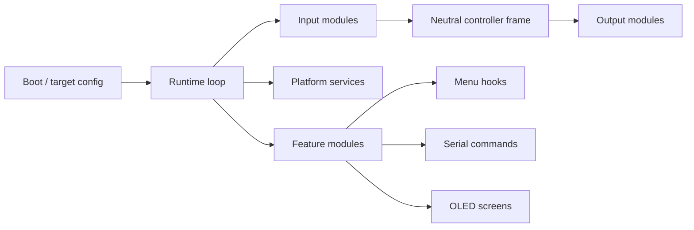

# Adapt Firmware Architecture

This overview describes the major firmware modules and their runtime boundaries.

Adapt firmware is organized around a shared runtime, target configuration, input
modules, a neutral controller frame, output modules, and optional feature
modules.

## Runtime Flow

## Core Areas

| Area | Responsibility |
|------|----------------|
| `firmware/config/` | Shared product selection and USB configuration |
| `firmware/config/classic2usb/` | Classic2USB roles, feature gates, board pins, identity strings, and default modes |
| `firmware/core/runtime/` | Firmware setup/loop, host detection, CDC command pump, and timing-safe runtime work |
| `firmware/input/` | Classic controller buses, input auto-detection, and memory-card access |
| `firmware/core/` | Neutral controller frame, settings storage, remap, turbo, hotkeys, calibration, and shared diagnostics |
| `firmware/output/` | USB device outputs, auth/key storage, and WebHID reports |
| `firmware/menu/` | OLED menu definitions, visibility, rendering, and home-screen controller views |
| `firmware/platform/` | OLED refresh, buzzer, RGB, buttons, latency capture, and platform services |
| `firmware/features/` | Optional feature modules with menu, serial, and OLED hooks |

`firmware/product_config.h` is a compatibility include wrapper over the target
configuration headers.

## Feature Modules

Feature modules register through `features/feature_module.h`.

| Hook | Purpose |
|------|---------|
| `handleMenuItem` | Process feature-owned menu rows |
| `shouldHideMenuItem` | Control feature-owned menu visibility |
| `handleSerialCommand` | Process feature serial commands |
| `appendSerialHelp` | Add feature commands to help text |
| `appendSerialState` | Add feature state to serial status output |
| `renderOledTransient` | Render feature-owned OLED transient screens |

Feature-owned behavior belongs in the feature module instead of generic menu,
core, or platform files.

## Auth MSC Content

`output/auth/auth_msc_runtime.cpp` owns the tiny FAT filesystem mechanics.
Product-specific MSC identity/content is provided through:

- `output/auth/auth_msc_content.h`
- `output/auth/auth_msc_content.cpp`

This keeps target-specific USB content separate from shared auth storage and MSC
runtime code.
